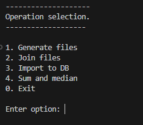
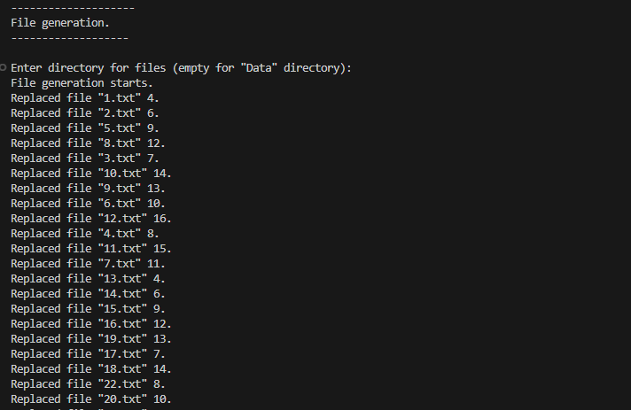
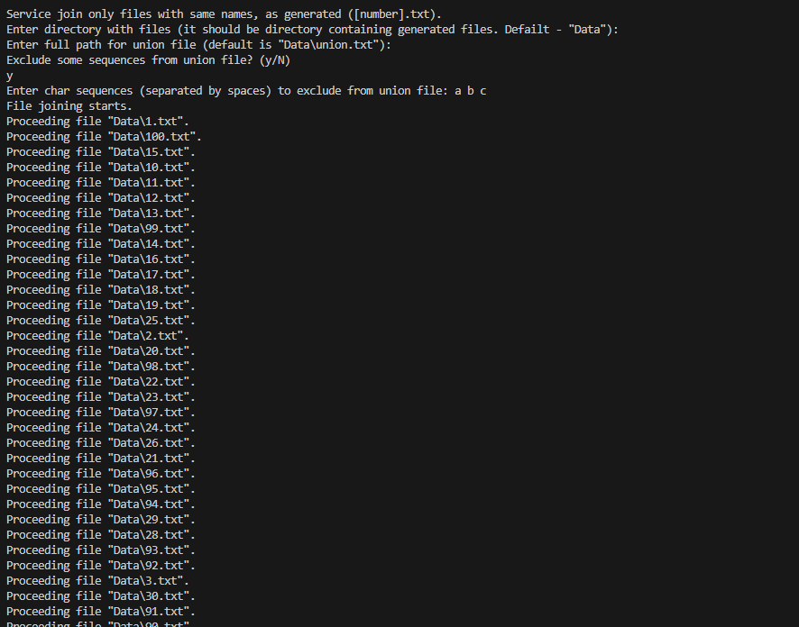
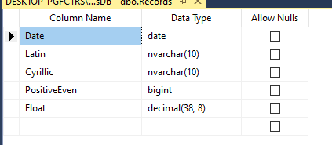
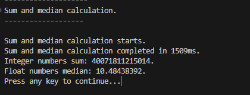

Как запустить:

Ввести: "dotnet run" в консоль, находясь в папке FileWorker

При запуске, в консоль будет выведено меню опций

.

После выбора опции 1 (генерация файлов), будет предложено указать путь к директории для файлов (Data по умолчанию).
На консоль будет выведена информация о ходе генерации.

После выбора опции 2 (объединение файлов), будет предложено указать путь к директории с файлов (Data по умолчанию).
Далее будет предложено указать путь и имя для файла объединения (Data/union.txt по умолчанию).
В конце спрашивается, следует ли удалять какие-либо строки из выходного файла, и предлагается их указать.
На консоль будет выведена информация о ходе генерации.

Опция 3 предлагает импорт файла в базу данных. Если база данных не создана, то она создается.
Структура созданной таблицы выглядит следующим образом:

Примечание: код работает только с базой данной SQL Server, так как для увеличения скорости импорта используется SqlBulkCopy

Последняя, 4 опция, создает в базе данных 2 хранимые процедуры (если уже не были созданы) и вызывает их.
Первая считает сумму всех целых чисел, а вторая - медиану всех дробных.

